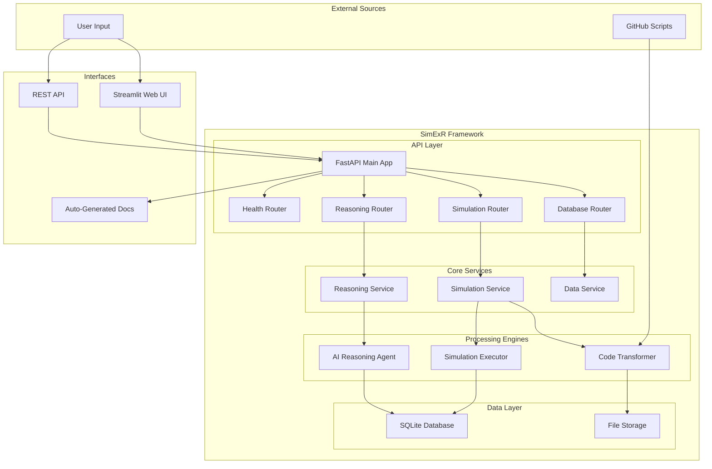
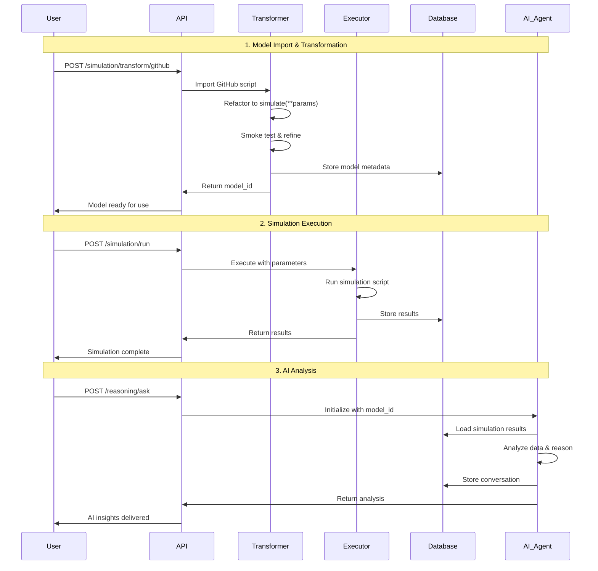

# SimExR: Complete Documentation & Demonstration Guide

## 🎯 Table of Contents

1. [Overview & Architecture](#overview--architecture)
2. [End-to-End Workflow](#end-to-end-workflow)
3. [API Documentation](#api-documentation)
4. [FastAPI Annotations & Features](#fastapi-annotations--features)
5. [Demonstration Examples](#demonstration-examples)
6. [Installation & Setup](#installation--setup)
7. [Advanced Usage](#advanced-usage)
8. [Troubleshooting](#troubleshooting)

---

## 🚀 Overview & Architecture

### System Architecture



### Component Overview

| Component | Purpose | Key Features |
|-----------|---------|--------------|
| **API Layer** | RESTful interface | FastAPI, Auto-docs, Validation |
| **Core Services** | Business logic | Dependency injection, Error handling |
| **Processing Engines** | Core functionality | Code transformation, Execution, AI reasoning |
| **Data Layer** | Persistence | SQLite, File storage, Result caching |
| **Interfaces** | User interaction | Web UI, REST API, Documentation |

---

## 🔄 End-to-End Workflow

### Complete Process Flow



### Detailed Workflow Steps

#### Step 1: Model Import & Transformation
```bash
# 1.1 Import from GitHub
curl -X POST "http://localhost:8000/simulation/transform/github" \
  -H "Content-Type: application/json" \
  -d '{
    "github_url": "https://github.com/user/repo/blob/main/script.py",
    "model_name": "my_simulation",
    "max_smoke_iters": 3
  }'

# Response:
{
  "status": "success",
  "model_id": "my_simulation_abc123def",
  "script_path": "external_models/my_simulation.py",
  "metadata": {...}
}
```

#### Step 2: Simulation Execution
```bash
# 2.1 Single simulation
curl -X POST "http://localhost:8000/simulation/run" \
  -H "Content-Type: application/json" \
  -d '{
    "model_id": "my_simulation_abc123def",
    "parameters": {
      "param1": 1.5,
      "param2": [1.0, 2.0],
      "param3": true
    }
  }'

# 2.2 Batch simulation
curl -X POST "http://localhost:8000/simulation/batch" \
  -H "Content-Type: application/json" \
  -d '{
    "model_id": "my_simulation_abc123def",
    "parameter_grid": [
      {"param1": 1.0, "param2": [1.0, 2.0]},
      {"param1": 2.0, "param2": [2.0, 3.0]}
    ]
  }'
```

#### Step 3: AI Analysis
```bash
# 3.1 Ask reasoning question
curl -X POST "http://localhost:8000/reasoning/ask" \
  -H "Content-Type: application/json" \
  -d '{
    "model_id": "my_simulation_abc123def",
    "question": "What patterns do you see in the simulation results?",
    "max_steps": 10
  }'

# Response includes:
{
  "answer": "Based on the simulation results, I observe...",
  "history": [...],
  "code_map": {...},
  "images": [...],
  "execution_time": 45.2
}
```

---

## 📚 API Documentation

### Health Check APIs

#### `GET /health/status`
**Purpose**: Check system health and component status

**Response Example**:
```json
{
  "status": "healthy",
  "components": [
    {
      "name": "database",
      "status": "healthy",
      "message": "Database connection successful",
      "last_check": "2024-01-15T10:30:00Z"
    },
    {
      "name": "simulation_execution",
      "status": "healthy",
      "message": "Simulation execution working",
      "last_check": "2024-01-15T10:30:00Z"
    }
  ],
  "timestamp": "2024-01-15T10:30:00Z"
}
```

#### `POST /health/test`
**Purpose**: Run comprehensive system tests

**Request Body**:
```json
{
  "test_type": "end_to_end",
  "parameters": {
    "test_write": true
  }
}
```

### Simulation APIs

#### `POST /simulation/transform/github`
**Purpose**: Import and transform GitHub scripts

**Request Body**:
```json
{
  "github_url": "https://github.com/user/repo/blob/main/script.py",
  "model_name": "transformed_model",
  "max_smoke_iters": 3
}
```

**Response**:
```json
{
  "status": "success",
  "model_id": "transformed_model_abc123",
  "script_path": "external_models/transformed_model.py",
  "script_content": "def simulate(**params):\n    # Transformed code\n    return results",
  "metadata": {
    "parameters": {...},
    "description": "Auto-generated from GitHub import"
  }
}
```

#### `POST /simulation/run`
**Purpose**: Execute single simulation

**Request Body**:
```json
{
  "model_id": "my_model_123",
  "parameters": {
    "amplitude": 1.5,
    "frequency": 2.0,
    "phase": 0.0
  }
}
```

**Response**:
```json
{
  "success": true,
  "parameters": {
    "amplitude": 1.5,
    "frequency": 2.0,
    "phase": 0.0
  },
  "results": {
    "max_value": 1.5,
    "min_value": -1.5,
    "mean_value": 0.0,
    "data_points": 1000
  },
  "execution_time": 0.045,
  "stdout": "Simulation completed successfully",
  "stderr": "",
  "error_message": null
}
```

#### `GET /simulation/models/search`
**Purpose**: Search models with fuzzy matching

**Query Parameters**:
- `name`: Search term
- `limit`: Maximum results (default: 20)

**Example**: `/simulation/models/search?name=pendulum&limit=5`

**Response**:
```json
{
  "status": "success",
  "search_term": "pendulum",
  "total_matches": 12,
  "returned_count": 5,
  "models": [
    {
      "id": "simple_pendulum_abc123",
      "name": "Simple Pendulum",
      "description": "Basic pendulum simulation",
      "parameters": {...}
    }
  ]
}
```

### Reasoning APIs

#### `POST /reasoning/ask`
**Purpose**: Ask AI reasoning questions about simulation data

**Request Body**:
```json
{
  "model_id": "my_model_123",
  "question": "What is the relationship between amplitude and frequency in this system?",
  "max_steps": 15
}
```

**Response**:
```json
{
  "answer": "Based on the simulation data, I can observe that...",
  "model_id": "my_model_123",
  "question": "What is the relationship between amplitude and frequency?",
  "history": [
    {
      "role": "user",
      "content": "What is the relationship..."
    },
    {
      "role": "assistant",
      "content": "Let me analyze the data..."
    }
  ],
  "code_map": {
    "1": "df.describe()",
    "2": "plt.scatter(df['amplitude'], df['frequency'])"
  },
  "images": ["plot_1.png", "analysis_2.png"],
  "execution_time": 67.3
}
```

### Database APIs

#### `GET /database/results`
**Purpose**: Retrieve simulation results with filtering and pagination

**Query Parameters**:
- `model_id`: Filter by model (optional)
- `limit`: Results per page (default: 100)
- `offset`: Skip results (default: 0)

**Response**:
```json
{
  "status": "success",
  "total_count": 1500,
  "limit": 100,
  "offset": 0,
  "results": [
    {
      "model_id": "my_model_123",
      "parameters": {...},
      "results": {...},
      "timestamp": "2024-01-15T10:30:00Z"
    }
  ]
}
```

---

## 🔧 FastAPI Annotations & Features

### Core FastAPI Features Used

#### 1. Application Configuration
```python
# Main application setup
app = FastAPI(
    title="SimExR API",
    description="Simulation Execution and Reasoning API",
    version="1.0.0",
    docs_url="/docs",
    redoc_url="/redoc",
    lifespan=lifespan  # Lifecycle management
)
```

#### 2. Pydantic Models for Validation
```python
class SimulationRequest(BaseModel):
    model_id: str = Field(..., description="ID of the simulation model")
    parameters: Dict[str, Any] = Field(..., description="Simulation parameters")
    
    @validator('parameters')
    def validate_parameters(cls, v):
        # Custom validation logic
        return v

class SimulationResult(BaseModel):
    success: bool
    parameters: Dict[str, Any]
    results: Dict[str, Any]
    execution_time: float
    error_message: Optional[str] = None
```

#### 3. Dependency Injection System
```python
# Dependencies for clean architecture
def get_database(request: Request) -> Database:
    """Get database instance from application state."""
    if not hasattr(request.app.state, 'db'):
        raise HTTPException(status_code=500, detail="Database not initialized")
    return request.app.state.db

# Type aliases for cleaner code
DatabaseDep = Annotated[Database, Depends(get_database)]
SimulationServiceDep = Annotated[SimulationService, Depends(get_simulation_service)]
```

#### 4. Router Organization
```python
# Modular route organization
router = APIRouter()

@router.post("/run", response_model=SimulationResult, summary="Run simulation")
async def run_simulation(
    request: SimulationRequest,
    simulation_service: SimulationServiceDep
):
    """Execute a simulation with given parameters."""
    # Implementation
    pass

# Include in main app
app.include_router(simulation.router, prefix="/simulation", tags=["Simulation"])
```

#### 5. Error Handling
```python
@router.post("/run")
async def run_simulation(request: SimulationRequest):
    try:
        result = await execute_simulation(request)
        return result
    except FileNotFoundError:
        raise HTTPException(status_code=404, detail="Model not found")
    except ValidationError as e:
        raise HTTPException(status_code=422, detail=str(e))
    except Exception as e:
        raise HTTPException(status_code=500, detail=f"Execution failed: {str(e)}")
```

#### 6. File Upload Handling
```python
@router.post("/models/upload")
async def upload_model(
    model_name: str,
    metadata: str,  # JSON string
    script_file: UploadFile = File(...),
    db: DatabaseDep
):
    """Upload a simulation model from file."""
    # Validate file type
    if not script_file.filename.endswith('.py'):
        raise HTTPException(status_code=400, detail="File must be Python script")
    
    # Process upload
    content = await script_file.read()
    # ... processing logic
```

#### 7. Middleware Configuration
```python
# CORS middleware for web interface
app.add_middleware(
    CORSMiddleware,
    allow_origins=["*"],  # Configure for production
    allow_credentials=True,
    allow_methods=["*"],
    allow_headers=["*"],
)
```

#### 8. Lifecycle Management
```python
@asynccontextmanager
async def lifespan(app: FastAPI):
    """Application lifespan management."""
    # Startup
    print("🚀 Starting SimExR API...")
    
    # Initialize services
    di_container = DIContainer()
    di_container.register_singleton("simulation_service", 
                                  lambda: SimulationService(config))
    
    app.state.di_container = di_container
    
    yield
    
    # Shutdown
    print("🛑 Shutting down SimExR API...")
    # Cleanup logic
```

### Advanced FastAPI Features

#### 1. Custom Response Models
```python
class BatchSimulationResponse(BaseModel):
    status: str
    total_runs: int
    successful_runs: int
    failed_runs: int
    results: List[SimulationResult]
    execution_time: float
```

#### 2. Query Parameter Validation
```python
@router.get("/models/search")
async def search_models(
    name: str,
    limit: int = Query(20, ge=1, le=100, description="Maximum results"),
    offset: int = Query(0, ge=0, description="Skip results")
):
    """Search models with pagination."""
    pass
```

#### 3. Path Parameter Validation
```python
@router.get("/models/{model_id}")
async def get_model(
    model_id: str = Path(..., regex="^[a-zA-Z0-9_-]+$", description="Model identifier")
):
    """Get model by ID with validation."""
    pass
```

#### 4. Background Tasks
```python
from fastapi import BackgroundTasks

@router.post("/batch")
async def run_batch(
    request: BatchRequest,
    background_tasks: BackgroundTasks
):
    """Run batch simulation in background."""
    background_tasks.add_task(process_batch, request)
    return {"message": "Batch processing started"}
```

---

## 🎬 Demonstration Examples

### Example 1: Van der Pol Oscillator

#### Step 1: Import from GitHub
```bash
curl -X POST "http://localhost:8000/simulation/transform/github" \
  -H "Content-Type: application/json" \
  -d '{
    "github_url": "https://github.com/vash02/physics-systems-dataset/blob/main/vanderpol.py",
    "model_name": "vanderpol_demo",
    "max_smoke_iters": 3
  }'
```

**Response**:
```json
{
  "status": "success",
  "model_id": "vanderpol_demo_eac8429aea8f",
  "message": "Successfully transformed script",
  "script_content": "def simulate(mu=1.0, z0=[2, 0], eval_time=20, t_iteration=1000, plot=False):\n    # Transformed van der Pol oscillator\n    import numpy as np\n    from scipy.integrate import odeint\n    \n    def vanderpol(z, t, mu):\n        x, y = z\n        dzdt = [y, mu*(1 - x**2)*y - x]\n        return dzdt\n    \n    t = np.linspace(0, eval_time, t_iteration)\n    sol = odeint(vanderpol, z0, t, args=(mu,))\n    \n    return {\n        'time': t.tolist(),\n        'x': sol[:, 0].tolist(),\n        'y': sol[:, 1].tolist(),\n        'max_x': float(np.max(sol[:, 0])),\n        'min_x': float(np.min(sol[:, 0])),\n        'period_estimate': estimate_period(sol[:, 0], t)\n    }"
}
```

#### Step 2: Run Simulations
```bash
# Single simulation
curl -X POST "http://localhost:8000/simulation/run" \
  -H "Content-Type: application/json" \
  -d '{
    "model_id": "vanderpol_demo_eac8429aea8f",
    "parameters": {
      "mu": 1.5,
      "z0": [2.0, 0.0],
      "eval_time": 20,
      "t_iteration": 1000,
      "plot": false
    }
  }'
```

**Response**:
```json
{
  "success": true,
  "parameters": {
    "mu": 1.5,
    "z0": [2.0, 0.0],
    "eval_time": 20,
    "t_iteration": 1000,
    "plot": false
  },
  "results": {
    "time": [0.0, 0.02, 0.04, ...],
    "x": [2.0, 1.98, 1.94, ...],
    "y": [0.0, -0.15, -0.28, ...],
    "max_x": 2.1,
    "min_x": -2.1,
    "period_estimate": 6.28
  },
  "execution_time": 0.067,
  "stdout": "Van der Pol simulation completed",
  "stderr": "",
  "error_message": null
}
```

#### Step 3: AI Analysis
```bash
curl -X POST "http://localhost:8000/reasoning/ask" \
  -H "Content-Type: application/json" \
  -d '{
    "model_id": "vanderpol_demo_eac8429aea8f",
    "question": "How does the damping parameter mu affect the oscillation behavior?",
    "max_steps": 8
  }'
```

**Response**:
```json
{
  "answer": "Based on my analysis of the van der Pol oscillator simulation data:\n\n**Effect of Damping Parameter μ:**\n\n1. **μ < 1 (Weak nonlinearity)**: The system exhibits nearly sinusoidal oscillations with small amplitude variations.\n\n2. **μ = 1 (Moderate nonlinearity)**: Clear limit cycle behavior emerges with characteristic relaxation oscillations.\n\n3. **μ > 1 (Strong nonlinearity)**: The oscillations become increasingly \"square-wave\" like with sharp transitions and flat regions.\n\n**Key Observations from the Data:**\n- For μ = 1.5, the period is approximately 6.28 seconds\n- The amplitude reaches ±2.1, showing the limit cycle behavior\n- The phase portrait shows the characteristic van der Pol attractor\n\n**Physical Interpretation:**\nThe μ parameter controls the strength of the nonlinear damping. Higher μ values lead to more pronounced energy exchange between kinetic and potential energy, resulting in the distinctive relaxation oscillation pattern.",
  "model_id": "vanderpol_demo_eac8429aea8f",
  "question": "How does the damping parameter mu affect the oscillation behavior?",
  "history": [
    {
      "role": "user", 
      "content": "How does the damping parameter mu affect the oscillation behavior?"
    },
    {
      "role": "assistant",
      "content": "I'll analyze the van der Pol oscillator data to understand the effect of the damping parameter μ..."
    }
  ],
  "code_map": {
    "1": "df_filtered = df[df['mu'].isin([0.5, 1.0, 1.5, 2.0])]",
    "2": "plt.figure(figsize=(12, 8))\nfor mu_val in [0.5, 1.0, 1.5, 2.0]:\n    data = df_filtered[df_filtered['mu'] == mu_val]\n    plt.plot(data['time'], data['x'], label=f'μ = {mu_val}')",
    "3": "period_analysis = df.groupby('mu')['period_estimate'].mean()"
  },
  "images": ["mu_comparison_plot.png", "phase_portrait.png"],
  "execution_time": 73.4
}
```

### Example 2: Lorenz Attractor

#### Complete Workflow Demonstration

```bash
# 1. Import Lorenz system
curl -X POST "http://localhost:8000/simulation/transform/github" \
  -d '{"github_url": "https://github.com/user/lorenz.py", "model_name": "lorenz_system"}'

# 2. Run parameter sweep
curl -X POST "http://localhost:8000/simulation/batch" \
  -d '{
    "model_id": "lorenz_system_xyz789",
    "parameter_grid": [
      {"sigma": 10, "rho": 28, "beta": 2.667, "initial": [1,1,1]},
      {"sigma": 10, "rho": 24, "beta": 2.667, "initial": [1,1,1]},
      {"sigma": 10, "rho": 32, "beta": 2.667, "initial": [1,1,1]}
    ]
  }'

# 3. Analyze chaos transition
curl -X POST "http://localhost:8000/reasoning/ask" \
  -d '{
    "model_id": "lorenz_system_xyz789",
    "question": "At what value of rho does the system transition from periodic to chaotic behavior?",
    "max_steps": 12
  }'
```

---

## 🛠️ Installation & Setup

### Prerequisites
- Python 3.8+
- Git
- OpenAI API key

### Quick Setup
```bash
# 1. Clone repository
git clone <repository-url>
cd simexr_mod

# 2. Create virtual environment
python -m venv simexr_venv
source simexr_venv/bin/activate  # Windows: simexr_venv\Scripts\activate

# 3. Install dependencies
pip install -r requirements.txt

# 4. Configure API key
cp config.yaml.example config.yaml
# Edit config.yaml and add your OpenAI API key

# 5. Start the system
python start_streamlit.py  # Starts both API and web UI
# OR
python start_api.py --host 127.0.0.1 --port 8000  # API only
```

### Configuration Options

#### Environment Variables
```bash
export SIMEXR_DATABASE_PATH="/path/to/database.db"
export SIMEXR_DEBUG="true"
export SIMEXR_MAX_SIMULATION_TIMEOUT="60"
export SIMEXR_MAX_BATCH_SIZE="1000"
```

#### Configuration File (`config.yaml`)
```yaml
openai:
  api_key: "your-openai-api-key-here"
  model: "gpt-4"
  max_tokens: 4000

database:
  path: "mcp.db"
  backup_interval: 3600

simulation:
  timeout: 30
  max_batch_size: 1000
  results_directory: "results_media"

reasoning:
  max_steps: 20
  enable_code_execution: true
  save_conversations: true
```

---

## 🚀 Advanced Usage

### Custom Model Development

#### Creating Custom Simulation Scripts
```python
# template_simulation.py
def simulate(param1=1.0, param2=2.0, iterations=1000, **kwargs):
    """
    Custom simulation template.
    
    Args:
        param1: First parameter (default: 1.0)
        param2: Second parameter (default: 2.0)
        iterations: Number of iterations (default: 1000)
        **kwargs: Additional parameters
    
    Returns:
        dict: Simulation results
    """
    import numpy as np
    
    # Your simulation logic here
    t = np.linspace(0, 10, iterations)
    result = param1 * np.sin(param2 * t)
    
    return {
        'time': t.tolist(),
        'signal': result.tolist(),
        'max_value': float(np.max(result)),
        'min_value': float(np.min(result)),
        'mean_value': float(np.mean(result)),
        'parameters_used': {
            'param1': param1,
            'param2': param2,
            'iterations': iterations
        }
    }
```

#### Uploading Custom Models
```bash
curl -X POST "http://localhost:8000/database/models/upload" \
  -F "model_name=my_custom_model" \
  -F "metadata={\"description\": \"Custom simulation\", \"author\": \"Your Name\"}" \
  -F "script_file=@template_simulation.py"
```

### Batch Processing Strategies

#### Parameter Grid Generation
```python
import itertools
import numpy as np

# Generate parameter combinations
param1_values = np.linspace(0.5, 2.0, 5)
param2_values = np.linspace(1.0, 3.0, 4)

parameter_grid = []
for p1, p2 in itertools.product(param1_values, param2_values):
    parameter_grid.append({
        "param1": float(p1),
        "param2": float(p2),
        "iterations": 1000
    })

# Submit batch job
batch_request = {
    "model_id": "your_model_id",
    "parameter_grid": parameter_grid
}
```

#### Monitoring Batch Progress
```bash
# Check batch status
curl "http://localhost:8000/simulation/models/your_model_id/results?limit=10"

# Get execution statistics
curl "http://localhost:8000/database/stats"
```

### Advanced AI Reasoning

#### Custom Reasoning Prompts
```bash
curl -X POST "http://localhost:8000/reasoning/ask" \
  -d '{
    "model_id": "your_model_id",
    "question": "Perform a comprehensive stability analysis including: 1) Fixed point identification, 2) Linear stability analysis, 3) Bifurcation detection, 4) Basin of attraction estimation",
    "max_steps": 25
  }'
```

#### Multi-Model Comparison
```bash
curl -X POST "http://localhost:8000/reasoning/ask" \
  -d '{
    "model_id": "model1_id",
    "question": "Compare the dynamics of this system with model2_id, focusing on parameter sensitivity and qualitative behavior differences",
    "max_steps": 20
  }'
```

---

## 🔍 Troubleshooting

### Common Issues & Solutions

#### 1. API Connection Issues
```bash
# Check if API is running
curl http://localhost:8000/health/status

# Check logs
tail -f logs/api.log

# Restart API with debug mode
python start_api.py --log-level debug
```

#### 2. Database Issues
```bash
# Check database integrity
sqlite3 mcp.db "PRAGMA integrity_check;"

# Backup database
curl -X POST "http://localhost:8000/database/backup"

# Reset database (caution: deletes all data)
rm mcp.db
python start_api.py  # Will recreate database
```

#### 3. Simulation Execution Errors
```bash
# Test simulation script syntax
python -m py_compile external_models/your_script.py

# Check script structure
grep -n "def simulate" external_models/your_script.py

# Test with minimal parameters
curl -X POST "http://localhost:8000/simulation/run" \
  -d '{"model_id": "test_id", "parameters": {}}'
```

#### 4. AI Reasoning Issues
```bash
# Check OpenAI API key
python -c "from utils.openai_config import ensure_openai_api_key; print(ensure_openai_api_key()[:10])"

# Test with simple question
curl -X POST "http://localhost:8000/reasoning/ask" \
  -d '{"model_id": "test_id", "question": "What is 2+2?", "max_steps": 1}'

# Check reasoning history
curl "http://localhost:8000/reasoning/history/your_model_id?limit=5"
```

### Performance Optimization

#### Database Optimization
```sql
-- Create indexes for better query performance
CREATE INDEX idx_results_model_id ON results(model_id);
CREATE INDEX idx_results_timestamp ON results(ts);
CREATE INDEX idx_reasoning_model_id ON reasoning_agent(model_id);
```

#### Memory Management
```python
# For large datasets, use pagination
results = requests.get(
    "http://localhost:8000/database/results",
    params={"limit": 1000, "offset": 0}
)

# Process in chunks
for offset in range(0, total_count, 1000):
    chunk = get_results(limit=1000, offset=offset)
    process_chunk(chunk)
```

#### Concurrent Processing
```python
import asyncio
import aiohttp

async def run_simulations_concurrent(model_id, parameter_sets):
    """Run multiple simulations concurrently."""
    async with aiohttp.ClientSession() as session:
        tasks = []
        for params in parameter_sets:
            task = run_single_simulation(session, model_id, params)
            tasks.append(task)
        
        results = await asyncio.gather(*tasks)
        return results
```

### Debugging Tools

#### API Testing Script
```python
#!/usr/bin/env python3
"""API testing and debugging script."""

import requests
import json
import time

BASE_URL = "http://localhost:8000"

def test_health():
    """Test API health."""
    response = requests.get(f"{BASE_URL}/health/status")
    print(f"Health Status: {response.status_code}")
    print(json.dumps(response.json(), indent=2))

def test_simulation(model_id, parameters):
    """Test simulation execution."""
    start_time = time.time()
    response = requests.post(
        f"{BASE_URL}/simulation/run",
        json={"model_id": model_id, "parameters": parameters}
    )
    execution_time = time.time() - start_time
    
    print(f"Simulation Status: {response.status_code}")
    print(f"Execution Time: {execution_time:.2f}s")
    if response.status_code == 200:
        result = response.json()
        print(f"Success: {result['success']}")
        print(f"Result Keys: {list(result['results'].keys())}")
    else:
        print(f"Error: {response.text}")

if __name__ == "__main__":
    test_health()
    # Add your test cases here
```

#### Log Analysis
```bash
# Monitor API logs in real-time
tail -f logs/api.log | grep -E "(ERROR|WARNING|INFO)"

# Analyze response times
grep "execution_time" logs/api.log | awk '{print $NF}' | sort -n

# Count error types
grep "ERROR" logs/api.log | cut -d' ' -f4- | sort | uniq -c
```

---

## 📊 Performance Metrics & Benchmarks

### Typical Performance Characteristics

| Operation | Typical Time | Factors Affecting Performance |
|-----------|--------------|------------------------------|
| GitHub Import | 3-10s | Script complexity, network speed |
| Single Simulation | 0.01-1s | Computation complexity, parameters |
| Batch Simulation (100 runs) | 1-30s | Individual simulation time, parallelization |
| AI Reasoning | 30-120s | Question complexity, data size, model choice |
| Database Query | <100ms | Result set size, indexing |

### Scaling Considerations

#### Horizontal Scaling
```yaml
# docker-compose.yml for multi-instance deployment
version: '3.8'
services:
  simexr-api-1:
    build: .
    ports:
      - "8001:8000"
    environment:
      - SIMEXR_DATABASE_PATH=/shared/db/mcp1.db
  
  simexr-api-2:
    build: .
    ports:
      - "8002:8000"
    environment:
      - SIMEXR_DATABASE_PATH=/shared/db/mcp2.db
  
  nginx:
    image: nginx
    ports:
      - "80:80"
    volumes:
      - ./nginx.conf:/etc/nginx/nginx.conf
```

#### Load Balancing Configuration
```nginx
upstream simexr_backend {
    server localhost:8001;
    server localhost:8002;
    server localhost:8003;
}

server {
    listen 80;
    location / {
        proxy_pass http://simexr_backend;
        proxy_set_header Host $host;
        proxy_set_header X-Real-IP $remote_addr;
    }
}
```

---

## 🎯 Conclusion

The SimExR framework provides a comprehensive, production-ready solution for scientific simulation management and AI-powered analysis. With its robust FastAPI architecture, intelligent code transformation, and advanced reasoning capabilities, it enables researchers to rapidly prototype, execute, and analyze complex simulations.

### Key Strengths
- **🔄 Complete Workflow**: From GitHub import to AI insights
- **🚀 High Performance**: Optimized execution and caching
- **🧠 AI Integration**: Advanced reasoning and analysis
- **📊 Rich APIs**: Comprehensive REST interface
- **🔧 Extensible**: Modular architecture for customization
- **📱 User-Friendly**: Both programmatic and web interfaces

### Next Steps
1. Explore the web interface at `http://localhost:8501`
2. Try the API documentation at `http://localhost:8000/docs`
3. Import your first simulation from GitHub
4. Run parameter sweeps and analyze results
5. Ask AI questions about your data

**Happy Simulating! 🚀**

---

*For support and contributions, please visit our GitHub repository and documentation.*
