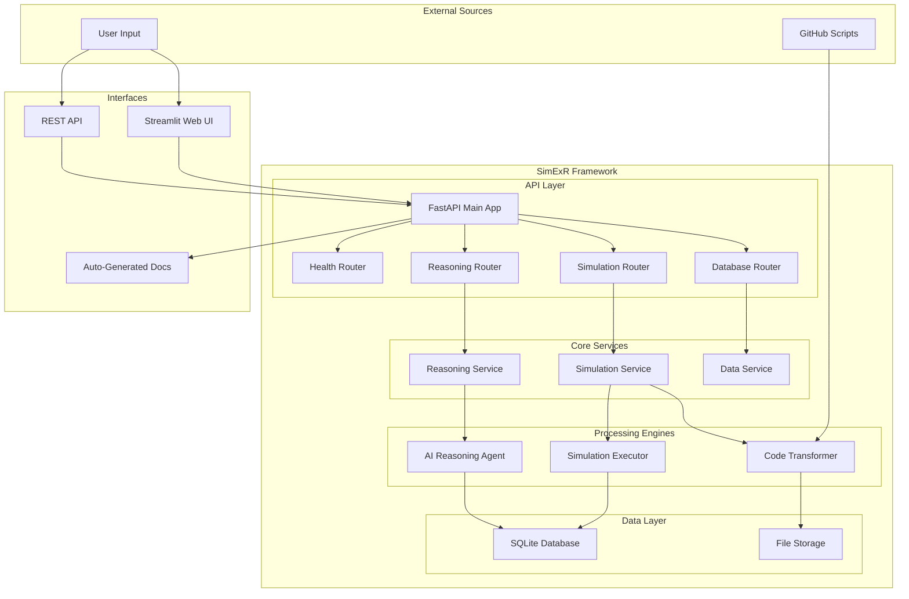

# SimExR: Simulation Execution and Reasoning Framework

Welcome to the comprehensive documentation for SimExR - a powerful framework for importing, executing, and analyzing scientific simulations with AI-powered reasoning capabilities.

## 🚀 Quick Navigation

<div style="display: grid; grid-template-columns: repeat(auto-fit, minmax(300px, 1fr)); gap: 20px; margin: 20px 0;">

<div style="border: 2px solid #0366d6; border-radius: 8px; padding: 20px; background: #f6f8fa;">
<h3>📚 Complete Documentation</h3>
<p>Comprehensive guide covering architecture, workflows, and advanced usage</p>
<a href="COMPLETE_DOCUMENTATION" style="background: #0366d6; color: white; padding: 8px 16px; text-decoration: none; border-radius: 4px;">Read Full Docs</a>
</div>

<div style="border: 2px solid #28a745; border-radius: 8px; padding: 20px; background: #f6f8fa;">
<h3>🔧 API Reference</h3>
<p>Detailed API documentation with examples and response formats</p>
<a href="API_REFERENCE" style="background: #28a745; color: white; padding: 8px 16px; text-decoration: none; border-radius: 4px;">View API Docs</a>
</div>

<div style="border: 2px solid #ffd33d; border-radius: 8px; padding: 20px; background: #f6f8fa;">
<h3>⚡ Quick Start</h3>
<p>Get up and running with SimExR in minutes</p>
<a href="QUICK_START" style="background: #ffd33d; color: black; padding: 8px 16px; text-decoration: none; border-radius: 4px;">Start Now</a>
</div>

<div style="border: 2px solid #f66a0a; border-radius: 8px; padding: 20px; background: #f6f8fa;">
<h3>🎬 Examples</h3>
<p>Real-world examples and demonstrations</p>
<a href="EXAMPLES" style="background: #f66a0a; color: white; padding: 8px 16px; text-decoration: none; border-radius: 4px;">See Examples</a>
</div>

</div>

## 🎯 What is SimExR?

SimExR is a comprehensive FastAPI-based framework that provides a complete pipeline for scientific simulation management:

- **🔄 Import & Transform**: Import external simulation scripts from GitHub and automatically transform them into standardized `simulate(**params)` functions
- **⚡ Execute**: Run single and batch simulations with automatic result storage and progress tracking
- **🧠 Analyze**: Use AI-powered reasoning agents to analyze simulation results and answer complex questions
- **📊 Manage**: Comprehensive REST APIs for managing models, results, and conversations

## 🏗️ System Architecture



## 🔄 End-to-End Workflow

### 1. Import & Transform
```bash
# Import simulation from GitHub
curl -X POST "http://localhost:8000/simulation/transform/github" \
  -d '{"github_url": "https://github.com/user/repo/script.py", "model_name": "my_model"}'
```

### 2. Execute Simulations
```bash
# Run single simulation
curl -X POST "http://localhost:8000/simulation/run" \
  -d '{"model_id": "my_model_abc123", "parameters": {"param1": 1.5, "param2": 2.0}}'

# Run batch simulations
curl -X POST "http://localhost:8000/simulation/batch" \
  -d '{"model_id": "my_model_abc123", "parameter_grid": [{"param1": 1.0}, {"param1": 2.0}]}'
```

### 3. AI Analysis
```bash
# Ask AI questions about results
curl -X POST "http://localhost:8000/reasoning/ask" \
  -d '{"model_id": "my_model_abc123", "question": "What patterns do you see in the data?"}'
```

## 🌟 Key Features

### 🔧 FastAPI Architecture
- **Modern async/await support** for high performance
- **Automatic API documentation** with Swagger UI and ReDoc
- **Pydantic models** for request/response validation
- **Dependency injection** for clean architecture
- **Comprehensive error handling** with structured responses

### 🧠 AI-Powered Analysis
- **Natural language questions** about simulation data
- **Automatic code generation** for data analysis
- **Visualization generation** with matplotlib/seaborn
- **Conversation history** tracking and management
- **Multi-step reasoning** with tool usage

### 📊 Data Management
- **SQLite database** for efficient storage
- **Automatic result storage** for all simulations
- **Pagination support** for large datasets
- **NaN handling** for scientific data
- **Backup and restore** functionality

### 🌐 User Interfaces
- **Streamlit web interface** for interactive use
- **REST API** for programmatic access
- **Auto-generated documentation** at `/docs`
- **Health monitoring** and system diagnostics

## 📈 Performance Metrics

| Operation | Typical Time | Scalability |
|-----------|--------------|-------------|
| GitHub Import | 3-10s | Single-threaded |
| Single Simulation | 0.01-1s | Highly parallel |
| Batch Simulation (100) | 1-30s | Progress tracking |
| AI Reasoning | 30-120s | OpenAI rate limits |
| Database Query | <100ms | Indexed queries |

## 🛠️ Installation

### Prerequisites
- Python 3.8+
- OpenAI API key
- Git

### Quick Setup
```bash
# Clone and setup
git clone <repository-url>
cd simexr_mod
python -m venv simexr_venv
source simexr_venv/bin/activate
pip install -r requirements.txt

# Configure
cp config.yaml.example config.yaml
# Edit config.yaml with your OpenAI API key

# Start system
python start_streamlit.py  # Web interface + API
# OR
python start_api.py        # API only
```

## 🎯 Use Cases

### 🔬 Research Applications
- **Parameter sweeps** for sensitivity analysis
- **Bifurcation studies** with automated detection
- **Model comparison** across different systems
- **Data exploration** with AI assistance

### 🏭 Industrial Applications
- **Process optimization** with batch simulations
- **Quality control** through automated analysis
- **Predictive modeling** with historical data
- **System monitoring** with real-time analysis

### 🎓 Educational Applications
- **Interactive demonstrations** of complex systems
- **Student projects** with guided analysis
- **Research training** with professional tools
- **Collaborative studies** with shared models

## 📚 Documentation Structure

### Core Documentation
- **[Complete Documentation](COMPLETE_DOCUMENTATION.md)**: Comprehensive guide with architecture, workflows, and examples
- **[API Reference](API_REFERENCE.md)**: Detailed API documentation with request/response examples
- **[Quick Start](QUICK_START.md)**: Get started in minutes with step-by-step instructions
- **[Examples](EXAMPLES.md)**: Real-world examples and demonstrations

### Specialized Guides
- **FastAPI Features**: Deep dive into annotations and functionality
- **AI Reasoning**: Understanding the reasoning agent capabilities
- **Performance Optimization**: Scaling and optimization strategies
- **Troubleshooting**: Common issues and solutions

## 🤝 Contributing

We welcome contributions! Please see our contributing guidelines:

1. **Fork the repository**
2. **Create a feature branch**: `git checkout -b feature/amazing-feature`
3. **Make your changes** with proper tests
4. **Submit a pull request** with detailed description

### Development Setup
```bash
# Development installation
pip install -r requirements-dev.txt

# Run tests
pytest tests/

# Code formatting
black .
isort .

# Type checking
mypy .
```

## 📄 License

This project is licensed under the MIT License - see the [LICENSE](../LICENSE) file for details.

## 🆘 Support

### Getting Help
- **📖 Documentation**: Start with this documentation
- **🐛 Issues**: Report bugs on GitHub Issues
- **💬 Discussions**: Join community discussions
- **📧 Contact**: Reach out for enterprise support

### Community Resources
- **GitHub Repository**: Source code and issue tracking
- **Documentation Site**: Comprehensive guides and tutorials
- **Example Gallery**: Real-world use cases and demonstrations
- **API Explorer**: Interactive API testing interface

---

## 🚀 Ready to Get Started?

<div style="text-align: center; margin: 40px 0;">
<a href="QUICK_START" style="background: linear-gradient(45deg, #0366d6, #28a745); color: white; padding: 15px 30px; text-decoration: none; border-radius: 8px; font-size: 18px; font-weight: bold; display: inline-block; margin: 10px;">🚀 Quick Start Guide</a>
<a href="COMPLETE_DOCUMENTATION" style="background: linear-gradient(45deg, #f66a0a, #ffd33d); color: white; padding: 15px 30px; text-decoration: none; border-radius: 8px; font-size: 18px; font-weight: bold; display: inline-block; margin: 10px;">📚 Full Documentation</a>
</div>

**SimExR Framework** - Empowering scientific simulation with AI reasoning capabilities.

---

*Last updated: January 2024 | Version: 1.0.0*
